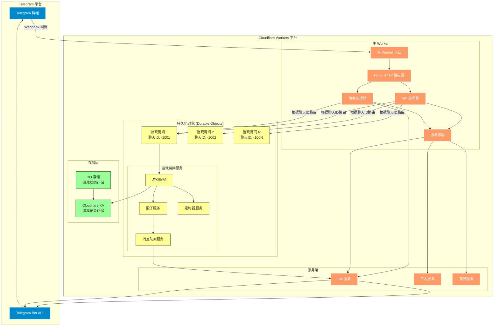
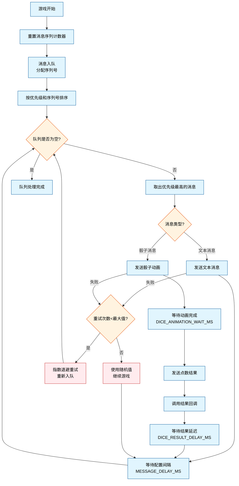
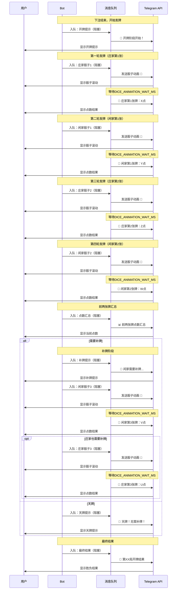

# 百家乐 Telegram Bot

一个部署在 Cloudflare Workers 上的 Telegram 百家乐游戏机器人，使用 Hono 和 Grammy 框架实现。支持群组游戏、自动化流程、完整百家乐规则以及自动游戏模式。

## 功能特性

### 🎲 游戏功能
- **完整百家乐规则**：支持庄家、闲家、和局三种下注类型
- **真实补牌规则**：严格遵循百家乐标准补牌规则
- **沉浸式发牌体验**：先显示骰子动画，等待4秒后公布点数，营造真实赌场氛围
- **严格发牌顺序**：开牌提示 → 庄1 → 闲1 → 庄2 → 闲2 → 点数汇总 → 补牌提示 → 补牌 → 最终结果
- **消息队列系统**：确保发牌顺序和消息一致性，防止并发问题
- **自动游戏流程**：30秒下注时间，精准倒计时提醒，自动开牌，结果公布
- **自动游戏模式**：支持连续自动进行游戏，每局间隔10秒
- **多群组支持**：每个群组通过 `Durable Objects` 维护独立游戏状态
- **数据持久化**：使用 `Cloudflare KV` 存储游戏记录，结合内存缓存

### 🤖 Bot 命令
- `/start` - 启动 Bot 并显示完整游戏说明
- `/id` - 获取群组和用户 ID 信息
- `/newgame` - 开始新的百家乐游戏
- `/bet <类型> <金额>` - 下注（banker/player/tie，例如 `/bet banker 100`）
- `/process` - 手动触发游戏处理（开牌）
- `/status` - 查看当前游戏状态和下注汇总
- `/stopgame` - 停止当前游戏并关闭自动模式
- `/autogame` - 开启自动游戏模式
- `/stopauto` - 关闭自动游戏模式
- `/history` - 查看最近10局游戏记录
- `/gameinfo <游戏编号>` - 查看指定游戏的详细信息
- `/help` - 显示帮助信息

### 🎯 游戏规则
- **下注类型**：
  - `banker` - 庄家胜（1:1赔率）
  - `player` - 闲家胜（1:1赔率）
  - `tie` - 和局（8:1赔率）
- **点数计算**：依照骰子1~6点数值，进行两次投掷计算。当总数值超过10时，只会计算总和的个位数。例如，如果一手牌是6和5，总和是11，其点数为1。
- **补牌规则**：
  - **天牌规则**：庄闲任一家点数总和为8、9视为天牌，双方皆不补牌
  - **闲家补牌**：两张牌点数合计为5(含)以下需补一张牌，6或以上则不需补牌
  - **庄家补牌**：
    - 庄家点数合计为0-4皆需补牌，7或以上不补牌
    - 当庄家点数为5时：闲家补1、4、5、6庄家需补牌，其他则不补牌
    - 当庄家点数为6时：闲家补6时庄家需补牌，其他则不补牌

### 🔧 HTTP API 接口
- `GET /` - 返回服务状态
- `GET /health` - 健康检查
- `POST /webhook` - 处理 Telegram Webhook 请求
- `POST /auto-game/:chatId` - 为指定群组自动开始游戏
- `POST /enable-auto/:chatId` - 启用自动游戏模式
- `POST /disable-auto/:chatId` - 禁用自动游戏模式
- `POST /process-game/:chatId` - 处理超时或手动触发的游戏
- `GET /game-status/:chatId` - 获取指定群组的游戏状态
- `POST /place-bet/:chatId` - 为指定群组下注
- `GET /game-history/:chatId` - 获取指定群组的最近游戏记录（最多10局）
- `GET /game-detail/:gameNumber` - 获取指定游戏编号的详细信息
- `POST /send-message` - 向指定群组发送消息
- `POST /set-webhook` - 设置 `Telegram Webhook`
- `GET /config` - 获取系统配置信息
- `GET /stats` - 获取服务统计信息
- `GET /commands` - 获取可用命令列表

## 🏗️ 系统架构



## 🔄 消息队列系统

### 设计理念
消息队列系统是整个游戏体验的核心，确保所有消息和骰子动画按严格顺序执行，避免并发导致的消息乱序问题。

### 核心特性
- **严格序列控制**：每个消息分配唯一序列号，确保按序处理
- **阻塞与非阻塞**：支持阻塞消息（等待完成）和非阻塞消息（立即返回）
- **骰子动画管理**：专门处理骰子发送和结果公布的完整流程
- **容错处理**：网络失败时自动重试，最终使用随机值保证游戏继续
- **游戏隔离**：每个游戏开始时重置消息序列，避免跨游戏干扰
- **优先级处理**：支持消息优先级调整
- **中间件支持**：可扩展的消息处理管道

### 消息类型

```typescript
interface QueuedMessage {
  id: string;              // 唯一消息ID
  chatId: string;          // 群组ID
  sequenceId: number;      // 严格序列号
  type: 'text' | 'dice';   // 消息类型
  isBlocking?: boolean;    // 是否阻塞后续消息
  priority?: number;       // 优先级（数字越小优先级越高）
  timestamp: number;       // 创建时间戳
  retries?: number;        // 重试次数
}

interface DiceMessage extends QueuedMessage {
  type: 'dice';
  playerType: string;      // 'banker' 或 'player'
  cardIndex: number;       // 第几张牌 (1,2,3)
  emoji: string;           // 骰子表情符号
  onDiceResult?: (value: number) => Promise<void>; // 结果回调
}
```

### 处理流程



## 🎴 发牌顺序详解

### 完整发牌流程



## 快速开始

### 1. 准备工作

```bash
# 克隆项目
git clone https://github.com/WuChenDi/bc-services.git
cd bc-services

# 安装依赖
pnpm install

# 安装 Wrangler CLI
pnpm install -g wrangler

# 登录 Cloudflare
wrangler login
```

### 2. 创建 Telegram Bot

1. 在 Telegram 中找到 [@BotFather](https://t.me/botfather)
2. 发送 `/newbot` 创建新 Bot
3. 设置 Bot 名称和用户名
4. 获取 Bot Token
5. 设置 Bot 命令菜单：
   ```
   /setcommands
   选择你的 Bot
   发送以下命令列表：
   start - 启动 Bot
   id - 获取群组ID
   newgame - 开始新游戏
   bet - 下注 (格式: /bet banker 100)
   process - 处理游戏
   status - 查看游戏状态
   stopgame - 停止游戏
   autogame - 开启自动游戏模式
   stopauto - 关闭自动游戏模式
   history - 查看最近10局记录
   gameinfo - 查看游戏详情
   help - 查看帮助
   ```

### 3. 配置 wrangler.jsonc

创建 `wrangler.jsonc` 文件：

```jsonc
{
  "$schema": "node_modules/wrangler/config-schema.json",
  "name": "bc-services",
  "main": "src/index.ts",
  "compatibility_date": "2025-07-19",
  "compatibility_flags": [
    "nodejs_compat"
  ],
  "vars": {
    // 基础配置
    "BOT_TOKEN": "your-bot-token-here",
    "ALLOWED_CHAT_IDS": "-1002509450778",
    
    // ===== 游戏时间配置 =====
    
    // 🎮 核心游戏时间
    "BETTING_DURATION_MS": "30000",           // 下注阶段持续时间 (30秒) - 用户下注的总时长
    "AUTO_GAME_INTERVAL_MS": "10000",         // 自动游戏间隔时间 (10秒) - 每局游戏结束后到下一局开始的等待时间
    
    // 🎲 骰子相关时间
    "DICE_ROLL_TIMEOUT_MS": "10000",          // 骰子投掷超时 (10秒) - 单次骰子API调用的最大等待时间
    "DICE_ROLL_MAX_RETRIES": "2",             // 骰子投掷最大重试次数 - 失败后重试的次数
    "DICE_ANIMATION_WAIT_MS": "4000",         // 骰子动画等待时间 (4秒) - 等待骰子动画播放完成的时间
    "DICE_RESULT_DELAY_MS": "1000",           // 结果发送延迟 (1秒) - 发送点数结果后的停顿时间
    
    // ⏱️ 流程控制时间
    "CARD_DEAL_DELAY_MS": "500",              // 发牌间隔 (0.5秒) - 每张牌之间的等待时间，让用户看清楚发牌过程
    "MESSAGE_DELAY_MS": "2000",               // 消息发送间隔 (2秒) - 重要消息之间的间隔，避免刷屏
    
    // 🔒 系统保护时间
    "GLOBAL_PROCESS_TIMEOUT_MS": "90000",     // 游戏处理全局超时 (90秒) - 整个游戏处理的最大时长，防止卡死
    "CLEANUP_DELAY_MS": "30000"               // 清理延迟时间 (30秒) - 游戏结束后多久开始清理资源
  },
  "kv_namespaces": [
    {
      "binding": "BC_GAME_KV",
      "id": "your-kv-namespace-id"
    }
  ],
  "observability": {
    "enabled": true,
    "head_sampling_rate": 1
  },
  "durable_objects": {
    "bindings": [
      {
        "name": "GAME_ROOMS",
        "class_name": "BaccaratGameRoom"
      }
    ]
  },
  "migrations": [
    {
      "tag": "v1",
      "new_sqlite_classes": [
        "BaccaratGameRoom"
      ]
    }
  ]
}
```

### 4. 创建 KV 存储

```bash
# 创建 KV namespace
wrangler kv:namespace create "BC_GAME_KV"

# 将返回的 namespace ID 添加到 wrangler.jsonc 中
```

### 5. 部署

```bash
# 开发环境测试
npm run dev

# 部署到生产环境
npm run deploy

# 设置 Webhook
curl -X POST "https://your-worker.workers.dev/set-webhook" \
  -H "Content-Type: application/json" \
  -d '{"url": "https://your-worker.workers.dev/webhook"}'
```

### 6. Telegram API 管理

```bash
# 查看当前 Webhook 信息
curl -X GET "https://api.telegram.org/bot<token>/getWebhookInfo"

# 删除现有 Webhook
curl -X GET "https://api.telegram.org/bot<token>/deleteWebhook"

# 设置新的 Webhook
curl -X POST "https://api.telegram.org/bot<token>/setWebhook" \
  -H "Content-Type: application/json" \
  -d '{"url": "https://your-worker.workers.dev/webhook"}'
```

## 项目结构

```
├── src/
│   ├── index.ts                          # 主程序入口
│   ├── config/
│   │   └── constants.ts                  # 时间配置管理
│   ├── durable-objects/
│   │   └── baccaratGameRoom.ts          # 游戏房间 Durable Object
│   ├── handlers/
│   │   ├── apiHandlers.ts               # HTTP API 路由处理
│   │   ├── commandHandlers.ts           # Bot 命令处理
│   │   └── index.ts                     # 处理器导出
│   ├── services/
│   │   ├── serviceContainer.ts          # 服务容器（依赖注入）
│   │   ├── base/
│   │   │   └── baseService.ts           # 基础服务类
│   │   ├── core/
│   │   │   ├── botService.ts            # Telegram Bot 服务
│   │   │   └── loggerService.ts         # 日志服务
│   │   ├── storage/
│   │   │   └── storageService.ts        # KV 存储服务
│   │   ├── messaging/
│   │   │   └── messageQueueService.ts   # 消息队列服务
│   │   ├── game/
│   │   │   ├── gameService.ts           # 核心游戏逻辑
│   │   │   ├── diceService.ts           # 骰子发送服务
│   │   │   └── timerService.ts          # 定时器服务
│   │   └── index.ts                     # 服务导出
│   ├── types/
│   │   ├── api.ts                       # API 类型定义
│   │   ├── base.ts                      # 基础类型
│   │   ├── env.ts                       # 环境变量类型
│   │   ├── game.ts                      # 游戏相关类型
│   │   ├── services.ts                  # 服务相关类型
│   │   ├── utils.ts                     # 工具类型
│   │   └── index.ts                     # 类型导出
│   └── utils/
│       ├── gameUtils.ts                 # 游戏工具函数
│       ├── messageUtils.ts              # 消息格式化工具
│       ├── timeUtils.ts                 # 时间工具函数
│       └── index.ts                     # 工具导出
├── package.json                         # 项目依赖
├── wrangler.jsonc                       # Cloudflare Workers 配置
├── tsconfig.json                        # TypeScript 配置
└── README.md                            # 项目说明文档
```

## 服务架构设计

### 依赖注入容器

项目采用了完整的依赖注入架构，通过 `ServiceContainer` 管理所有服务实例：

```typescript
// 服务容器创建
const container = ServiceContainer.create(env, bot, state);

// 服务获取（单例模式）
const gameService = container.getService(GameService);
const diceService = container.getService(DiceService);
```

### 服务层次结构

1. **基础服务层** (`base/`)
   - `BaseService`: 所有服务的基类，提供日志、生命周期管理

2. **核心服务层** (`core/`)
   - `BotService`: Telegram Bot API 封装
   - `LoggerService`: 统一日志管理

3. **存储服务层** (`storage/`)
   - `StorageService`: KV 存储操作

4. **消息服务层** (`messaging/`)
   - `MessageQueueService`: 消息队列管理

5. **游戏业务层** (`game/`)
   - `GameService`: 核心游戏逻辑
   - `DiceService`: 骰子投掷和动画
   - `TimerService`: 定时器管理

### 上下文管理

所有服务共享统一的上下文信息：

```typescript
interface ServiceContext {
  env: Env;                    // 环境变量
  bot: Bot;                    // Bot 实例
  state?: DurableObjectState;  // DO 状态（可选）
  constants: Constants;        // 配置常量
  gameId?: string;            // 当前游戏ID
  chatId?: string;            // 当前聊天ID
  userId?: string;            // 当前用户ID
}
```

## 核心技术特性

### 游戏状态管理
```typescript
enum GameState {
  Idle = 'idle',              // 空闲
  Betting = 'betting',        // 下注中
  Processing = 'processing',  // 处理中
  Revealing = 'revealing',    // 开牌中
  Finished = 'finished'       // 已结束
}
```

### 下注处理逻辑

支持多种下注模式：
- **累加下注**：同类型下注累加金额
- **替换下注**：不同类型下注互相替换
- **限额检查**：单次下注和用户总下注限制

```typescript
// 下注响应示例
{
  success: true,
  amount: 150,              // 最终下注金额
  isAccumulated: true,      // 是否为累加下注
  previousAmount: 50,       // 之前的下注金额
  addedAmount: 100,         // 新增的下注金额
  totalBetsAmount: 500,     // 当前游戏总下注金额
  totalBetsCount: 8,        // 当前游戏总下注次数
  usersCount: 3,            // 参与下注的用户数
  remainingTime: 25         // 剩余下注时间(秒)
}
```

### 精准倒计时系统

```typescript
private setupCountdownTimers(chatId: string, gameNumber: string): void {
  const gameEndTime = this.game.bettingEndTime;
  const intervals = [20, 10, 5]; // 提醒时间点

  intervals.forEach(seconds => {
    const reminderTime = gameEndTime - (seconds * 1000);
    const timeToReminder = reminderTime - Date.now();

    if (timeToReminder > 0) {
      this.timerService.createGameTimer(
        TimerType.COUNTDOWN,
        `countdown-${seconds}s`,
        timeToReminder,
        () => this.sendCountdownMessage(chatId, seconds)
      );
    }
  });
}
```

### 消息队列核心实现

```typescript
// 严格序列处理
private async processQueue(): Promise<void> {
  this.processing = true;
  
  while (this.queue.length > 0) {
    const message = this.queue.shift()!;
    
    try {
      await this.processMessage(message);
      await sleep(this.queueConfig.messageInterval);
    } catch (error) {
      await this.handleMessageError(message, error);
    }
  }
  
  this.processing = false;
}
```

### 补牌规则实现

完整的百家乐补牌逻辑：

```typescript
private async handleThirdCard(bankerSum: number, playerSum: number): Promise<void> {
  const diceService = this.getService(DiceService);
  let playerThirdCard: number | null = null;

  // 闲家补牌逻辑：两张牌点数合计为5(含)以下需补一张牌
  if (playerSum <= 5) {
    await diceService.sendBlockingMessage(
      this.game.chatId,
      `👤 **闲家点数${playerSum}，需要补牌...**`
    );
    
    const playerCard3Result = await diceService.rollDice(this.game.chatId, 'player', 3);
    playerThirdCard = playerCard3Result.value!;
    this.game.cards.player.push(playerThirdCard);
  } else {
    await diceService.sendBlockingMessage(
      this.game.chatId,
      `👤 **闲家点数${playerSum}，不需补牌**`
    );
  }

  // 庄家补牌逻辑
  let bankerNeedCard = false;
  let bankerReason = '';

  if (bankerSum <= 4) {
    // 庄家点数0-4皆需补牌
    bankerNeedCard = true;
    bankerReason = `点数${bankerSum}需补牌`;
  } else if (bankerSum >= 7) {
    // 7或以上不补牌
    bankerNeedCard = false;
    bankerReason = `点数${bankerSum}不补牌`;
  } else if (bankerSum === 5) {
    // 当庄家点数为5时：闲家补1、4、5、6庄家需补牌，其他则不补牌
    if (playerThirdCard === null) {
      bankerNeedCard = true;
      bankerReason = `点数5且闲家未补牌需补牌`;
    } else if ([1, 4, 5, 6].includes(playerThirdCard)) {
      bankerNeedCard = true;
      bankerReason = `点数5且闲家补牌${playerThirdCard}需补牌`;
    } else {
      bankerNeedCard = false;
      bankerReason = `点数5且闲家补牌${playerThirdCard}不补牌`;
    }
  } else if (bankerSum === 6) {
    // 当庄家点数为6时：闲家补6时庄家需补牌，其他则不补牌
    if (playerThirdCard === null) {
      bankerNeedCard = false;
      bankerReason = `点数6且闲家未补牌不补牌`;
    } else if (playerThirdCard === 6) {
      bankerNeedCard = true;
      bankerReason = `点数6且闲家补牌6需补牌`;
    } else {
      bankerNeedCard = false;
      bankerReason = `点数6且闲家补牌${playerThirdCard}不补牌`;
    }
  }

  if (bankerNeedCard) {
    await diceService.sendBlockingMessage(
      this.game.chatId,
      `🏦 **庄家${bankerReason}...**`
    );
    
    const bankerCard3Result = await diceService.rollDice(this.game.chatId, 'banker', 3);
    this.game.cards.banker.push(bankerCard3Result.value!);
  } else {
    await diceService.sendBlockingMessage(
      this.game.chatId,
      `🏦 **庄家${bankerReason}**`
    );
  }
}
```

## 时间参数配置详解

### 🎮 核心游戏时间配置

| 参数                    | 默认值 | 说明                                                           |
| ----------------------- | ------ | -------------------------------------------------------------- |
| `BETTING_DURATION_MS`   | 30000  | 下注阶段持续时间（毫秒），用户可以下注的总时长                 |
| `AUTO_GAME_INTERVAL_MS` | 10000  | 自动游戏间隔时间（毫秒），每局游戏结束后到下一局开始的等待时间 |

### 🎲 骰子体验配置

| 参数                     | 默认值 | 说明                                                           |
| ------------------------ | ------ | -------------------------------------------------------------- |
| `DICE_ROLL_TIMEOUT_MS`   | 10000  | 骰子投掷超时时间（毫秒），单次骰子API调用的最大等待时间        |
| `DICE_ROLL_MAX_RETRIES`  | 2      | 骰子投掷最大重试次数，失败后重试的次数                         |
| `DICE_ANIMATION_WAIT_MS` | 4000   | 骰子动画等待时间（毫秒），等待骰子动画播放完成的时间           |
| `DICE_RESULT_DELAY_MS`   | 1000   | 结果发送延迟（毫秒），发送点数结果后的停顿时间，让用户消化结果 |

### ⏱️ 流程控制配置

| 参数                 | 默认值 | 说明                                                             |
| -------------------- | ------ | ---------------------------------------------------------------- |
| `CARD_DEAL_DELAY_MS` | 500    | 发牌间隔时间（毫秒），每张牌之间的等待时间，让用户看清楚发牌过程 |
| `MESSAGE_DELAY_MS`   | 2000   | 消息发送间隔（毫秒），重要消息之间的间隔，避免刷屏               |

### 🔒 系统保护配置

| 参数                        | 默认值 | 说明                                                       |
| --------------------------- | ------ | ---------------------------------------------------------- |
| `GLOBAL_PROCESS_TIMEOUT_MS` | 90000  | 游戏处理全局超时（毫秒），整个游戏处理的最大时长，防止卡死 |
| `CLEANUP_DELAY_MS`          | 30000  | 清理延迟时间（毫秒），游戏结束后多久开始清理资源           |

### 🎯 时间配置优化建议

**快节奏游戏设置**：
```toml
BETTING_DURATION_MS = "20000"        # 20秒下注
AUTO_GAME_INTERVAL_MS = "5000"       # 5秒间隔
DICE_ANIMATION_WAIT_MS = "3000"      # 3秒动画
MESSAGE_DELAY_MS = "1500"            # 1.5秒消息间隔
```

**慢节奏体验设置**：
```toml
BETTING_DURATION_MS = "45000"        # 45秒下注
AUTO_GAME_INTERVAL_MS = "15000"      # 15秒间隔
DICE_ANIMATION_WAIT_MS = "5000"      # 5秒动画
MESSAGE_DELAY_MS = "3000"            # 3秒消息间隔
```

**网络环境差的设置**：
```toml
DICE_ROLL_TIMEOUT_MS = "15000"       # 15秒超时
DICE_ROLL_MAX_RETRIES = "3"          # 3次重试
GLOBAL_PROCESS_TIMEOUT_MS = "120000" # 2分钟总超时
```

## 游戏流程详解

### 1. 开始游戏
```
管理员或成员: /newgame
Bot: 🎮 新游戏已开始！
     游戏编号: 20250719143001
     ⏰ 下注时间: 30秒
     💰 使用 /bet 命令进行下注
```

### 2. 下注阶段（精准倒计时）
```
玩家A: /bet banker 100
Bot: ✅ 下注成功！
     类型: 庄家
     金额: 100 点
     当前总下注: 100 点

玩家B: /bet player 50
Bot: ✅ 下注成功！
     类型: 闲家
     金额: 50 点
     当前总下注: 150 点

# 系统自动倒计时提醒
Bot: ⏰ **下注倒计时：20秒！**
     👥 当前参与人数：2
     💡 抓紧时间下注哦~

Bot: ⏰ **下注倒计时：10秒！**
     👥 当前参与人数：2
     💡 抓紧时间下注哦~

Bot: ⏰ **下注倒计时：5秒！**
     👥 当前参与人数：2
     💡 抓紧时间下注哦~
```

### 3. 沉浸式开牌体验
30秒后或手动 `/process`：
```
Bot: ⛔ **第 20250719143001 局停止下注！**

     📋 **第 20250719143001 局下注汇总**
     👥 参与人数: 2
     💰 总下注: 150 点
     
     📊 **各项下注:**
     🏦 庄家: 100 点
     👤 闲家: 50 点
     🤝 和局: 0 点
     
     🎲 准备开牌...

Bot: 🎲 **开牌阶段开始！**
     🃏 庄家和闲家各发两张牌...

# 发送骰子动画
Bot: 🎲 (骰子动画滚动 4秒)

# 4秒后公布结果
Bot: 🎯 **🏦 庄家第1张牌开出：4 点**

# 继续发牌
Bot: 🎲 (骰子动画滚动 4秒)
Bot: 🎯 **👤 闲家第1张牌开出：2 点**

Bot: 🎲 (骰子动画滚动 4秒)
Bot: 🎯 **🏦 庄家第2张牌开出：1 点**

Bot: 🎲 (骰子动画滚动 4秒)
Bot: 🎯 **👤 闲家第2张牌开出：3 点**
     
Bot: 📊 **前两张牌点数:**
     🏦 庄家: 4 + 1 = **5 点**
     👤 闲家: 2 + 3 = **5 点**

# 补牌阶段 - 根据新规则
Bot: 👤 **闲家点数5，需要补牌...**
Bot: 🎲 (骰子动画滚动 4秒)
Bot: 🎯 **👤 闲家第3张牌开出：6 点**

Bot: 🏦 **庄家点数5且闲家补牌6需补牌...**
Bot: 🎲 (骰子动画滚动 4秒)
Bot: 🎯 **🏦 庄家第3张牌开出：2 点**
     
Bot: 🎯 **第 20250719143001 局开牌结果**
     🏦 庄家最终点数: 7 点 (4+1+2)
     👤 闲家最终点数: 1 点 (2+3+6=11→1)
     
     🏆 **🏦 庄家胜！**
     
     ✅ **获胜者:**
     玩家A: +100
     
     ❌ **失败者:**
     玩家B: -50
     
     📊 **本局统计:**
     💰 总赔付: 100 点
     💸 总收取: 50 点
     📈 庄家盈亏: -50 点
     
     🎮 **手动游戏模式**
     💡 使用 /newgame 开始新游戏
     🤖 使用 /autogame 开启自动模式
```

### 4. 天牌情况示例
```
Bot: 📊 **前两张牌点数:**
     🏦 庄家: 6 + 3 = **9 点**
     👤 闲家: 4 + 2 = **6 点**
     
Bot: 🎯 **天牌！无需补牌！**
     
Bot: 🎯 **第 20250719143002 局开牌结果**
     🏦 庄家最终点数: 9 点
     👤 闲家最终点数: 6 点
     
     🏆 **🏦 庄家胜！**
```

### 5. 补牌规则详细示例

#### 5.1 闲家不需补牌，庄家需补牌
```
Bot: 📊 **前两张牌点数:**
     🏦 庄家: 2 + 1 = **3 点**
     👤 闲家: 5 + 2 = **7 点**
     
Bot: 👤 **闲家点数7，不需补牌**
Bot: 🏦 **庄家点数3需补牌...**
Bot: 🎲 (骰子动画滚动 4秒)
Bot: 🎯 **🏦 庄家第3张牌开出：4 点**
     
Bot: 🎯 **第 20250719143003 局开牌结果**
     🏦 庄家最终点数: 7 点 (2+1+4)
     👤 闲家最终点数: 7 点
     
     🏆 **🤝 和局！**
```

#### 5.2 庄家点数为6时的补牌规则
```
Bot: 📊 **前两张牌点数:**
     🏦 庄家: 4 + 2 = **6 点**
     👤 闲家: 1 + 2 = **3 点**
     
Bot: 👤 **闲家点数3，需要补牌...**
Bot: 🎲 (骰子动画滚动 4秒)
Bot: 🎯 **👤 闲家第3张牌开出：6 点**

Bot: 🏦 **庄家点数6且闲家补牌6需补牌...**
Bot: 🎲 (骰子动画滚动 4秒)
Bot: 🎯 **🏦 庄家第3张牌开出：1 点**
     
Bot: 🎯 **第 20250719143004 局开牌结果**
     🏦 庄家最终点数: 7 点 (4+2+1)
     👤 闲家最终点数: 9 点 (1+2+6)
     
     🏆 **👤 闲家胜！**
```

#### 5.3 庄家点数为6，闲家补牌非6时不补牌
```
Bot: 📊 **前两张牌点数:**
     🏦 庄家: 3 + 3 = **6 点**
     👤 闲家: 2 + 1 = **3 点**
     
Bot: 👤 **闲家点数3，需要补牌...**
Bot: 🎲 (骰子动画滚动 4秒)
Bot: 🎯 **👤 闲家第3张牌开出：4 点**

Bot: 🏦 **庄家点数6且闲家补牌4不补牌**
     
Bot: 🎯 **第 20250719143005 局开牌结果**
     🏦 庄家最终点数: 6 点
     👤 闲家最终点数: 7 点 (2+1+4)
     
     🏆 **👤 闲家胜！**
```

### 6. 自动游戏模式
```
管理员: /autogame
Bot: ✅ 自动游戏模式已启用
     🤖 **自动游戏 - 第 20250719143006 局开始！**
     💰 下注时间：30秒
     📝 下注格式：/bet banker 100
     ⏰ 30秒后将自动处理游戏...
     🔄 游戏将持续自动进行

# 游戏结束时
Bot: 🤖 **自动游戏模式进行中**
     ⏰ 10秒后自动开始下一局
     🛑 使用 /stopauto 关闭自动模式
     📊 本次已完成 5 局游戏
```

### 7. 无人下注情况
```
Bot: ⛔ **第 20250719143007 局停止下注！**

Bot: 😔 **第 20250719143007 局无人下注**

     🎲 但游戏继续进行，开始发牌...

# 继续正常发牌流程，但结果中不显示输赢统计
Bot: 🎯 **第 20250719143007 局开牌结果**
     🏦 庄家最终点数: 5 点
     👤 闲家最终点数: 8 点
     
     🏆 **👤 闲家胜！**
     
     😔 **无人下注**
     
     🎮 **手动游戏模式**
     💡 使用 /newgame 开始新游戏
     🤖 使用 /autogame 开启自动模式
```

### 8. 累加和替换下注示例
```
玩家A: /bet banker 100
Bot: ✅ 下注成功！
     类型: 庄家
     金额: 100 点

玩家A: /bet banker 50
Bot: ✅ 下注成功！
     类型: 庄家  
     金额: 150 点 (累加：原100点 + 新增50点)

玩家A: /bet player 200
Bot: ✅ 下注成功！
     类型: 闲家
     金额: 200 点 (替换：取消庄家150点，改投闲家200点)
```

### 9. 查看游戏状态和历史
```
用户: /status
Bot: 📊 **游戏状态**
     🎮 状态: 下注中
     🎯 游戏编号: 20250719143008
     👥 参与人数: 3 人
     💰 总下注: 350 点
     ⏰ 剩余时间: 15 秒

用户: /history
Bot: 📊 **最近10局游戏记录**
     
     1. **20250719143007**
        07/19 14:35 | 👤闲 | 5-8 | 0人
     
     2. **20250719143006**
        07/19 14:34 | 🏦庄 | 7-6 | 2人
     
     3. **20250719143005**
        07/19 14:33 | 👤闲 | 6-7 | 1人
     
     💡 使用 /gameinfo <游戏编号> 查看详情

用户: /gameinfo 20250719143005
Bot: 🎯 **游戏详情 - 20250719143005**
     
     📅 开始时间: 2025/07/19 14:33:15
     ⏰ 结束时间: 2025/07/19 14:33:52
     ⏱️ 游戏时长: 37秒
     
     🎲 **开牌结果:**
     🏦 庄家: 3 + 3 = 6点
     👤 闲家: 2 + 1 + 4 = 7点
     🏆 **👤 闲家胜**
     
     💰 **下注情况:**
     👥 参与人数: 1
     💵 总下注额: 100点
     
     📊 **分类下注:**
     🏦 庄家: 100点
     👤 闲家: 0点
     🤝 和局: 0点
```

## API 使用示例

### 自动化游戏管理
```bash
# 为指定群组自动开始游戏
curl -X POST "https://your-worker.workers.dev/auto-game/-1001234567890" \
  -H "Content-Type: application/json"

# 启用自动游戏模式
curl -X POST "https://your-worker.workers.dev/enable-auto/-1001234567890" \
  -H "Content-Type: application/json"

# 禁用自动游戏模式
curl -X POST "https://your-worker.workers.dev/disable-auto/-1001234567890" \
  -H "Content-Type: application/json"

# 检查游戏状态
curl "https://your-worker.workers.dev/game-status/-1001234567890"

# 为指定群组下注
curl -X POST "https://your-worker.workers.dev/place-bet/-1001234567890" \
  -H "Content-Type: application/json" \
  -d '{
    "userId": "123456789",
    "userName": "TestUser",
    "betType": "banker",
    "amount": 100
  }'

# 获取最近游戏记录
curl "https://your-worker.workers.dev/game-history/-1001234567890"

# 获取指定游戏详情
curl "https://your-worker.workers.dev/game-detail/20250719143001"

# 获取系统配置
curl "https://your-worker.workers.dev/config"

# 获取服务统计
curl "https://your-worker.workers.dev/stats"
```

### 消息发送
```bash
# 发送游戏通知
curl -X POST "https://your-worker.workers.dev/send-message" \
  -H "Content-Type: application/json" \
  -d '{
    "chatId": "-1001234567890",
    "message": "🎮 **百家乐夜场即将开始！**\n\n准备好你的筹码了吗？",
    "parseMode": "Markdown"
  }'
```

## 健康检查和监控

### 服务健康状态

系统提供多层次的健康检查：

1. **容器级健康检查**：检查服务容器状态
2. **服务级健康检查**：每个服务独立的健康状态
3. **游戏级健康检查**：游戏逻辑和状态检查
4. **队列级健康检查**：消息队列处理状态

```bash
# 基础健康检查
curl "https://your-worker.workers.dev/health"

# 详细服务统计
curl "https://your-worker.workers.dev/stats"

# 游戏房间健康状态
curl "https://your-worker.workers.dev/game-status/-1001234567890"
```

### 监控指标

系统自动收集以下监控指标：

- **游戏统计**：已开始/完成/失败的游戏数、平均游戏时长
- **下注统计**：总下注次数、总金额、用户参与度
- **消息队列**：处理消息数、成功率、平均处理时间、队列长度
- **骰子服务**：投掷次数、成功率、分布均匀性、备用值使用
- **定时器服务**：创建/完成/取消的定时器数、执行成功率
- **存储服务**：读写操作数、缓存命中率、错误率
- **Bot 服务**：API 调用次数、消息发送成功率、错误类型

## 环境变量配置

| 变量名             | 必需 | 说明                         | 示例                            |
| ------------------ | ---- | ---------------------------- | ------------------------------- |
| `BOT_TOKEN`        | ✅    | Telegram Bot Token           | `1234567890:ABC...`             |
| `ALLOWED_CHAT_IDS` | ❌    | 允许的群组ID列表（逗号分隔） | `-1001234567890,-1009876543210` |

所有时间相关参数都在 `wrangler.jsonc` 的 `vars` 字段中配置。

## 故障排除

### 常见问题

1. **游戏无法开始**
   - 检查 Bot 是否有群组发送消息权限
   - 确认 `BOT_TOKEN` 和 KV 配置正确
   - 检查是否存在未结束的游戏（使用 `/status` 查看）
   - 验证 Durable Objects 绑定是否正确

2. **下注失败**
   - 确保下注在指定时间内（`/status` 查看剩余时间）
   - 验证下注格式（例如 `/bet banker 100`）
   - 确认游戏状态为 `betting`
   - 检查下注金额是否超过限制（1-10000点）

3. **倒计时时间不一致**
   - 检查服务器时间同步
   - 确认 `BETTING_DURATION_MS` 配置正确
   - 验证定时器服务是否正常运行

4. **骰子发送失败**
   - 检查 Telegram API 连接状态
   - 调整 `DICE_ROLL_TIMEOUT_MS` 和重试次数
   - 确认群组允许发送动画消息
   - 查看是否使用了备用随机值

5. **消息顺序混乱**
   - 检查消息队列状态（通过 `/game-status` 获取调试信息）
   - 确认游戏开始时队列是否正确重置
   - 验证序列号分配是否正确递增
   - 检查消息优先级设置

6. **Webhook 问题**
   - 验证 Workers URL 是否可访问
   - 检查 SSL 证书是否有效
   - 确保防火墙未阻止 Telegram 的请求
   - 使用 `wrangler tail` 查看实时日志

### 调试技巧

```bash
# 检查 Webhook 状态
curl "https://api.telegram.org/bot<YOUR_TOKEN>/getWebhookInfo"

# 测试 API 连通性
curl "https://your-worker.workers.dev/health"

# 查看特定群组游戏状态（含调试信息）
curl "https://your-worker.workers.dev/game-status/-1001234567890"

# 查看系统配置
curl "https://your-worker.workers.dev/config"

# 查看服务统计
curl "https://your-worker.workers.dev/stats"

# 实时查看 Workers 日志
wrangler tail

# 测试命令响应
curl "https://your-worker.workers.dev/commands"
```

### 游戏状态调试

游戏状态 API 提供详细的调试信息：

```json
{
  "success": true,
  "status": {
    "gameNumber": "20250719143001",
    "state": "betting",
    "betsCount": 2,
    "totalBets": 150,
    "timeRemaining": 25,
    "debug": {
      "queueLength": 0,
      "queueProcessing": false,
      "isProcessing": false,
      "revealingInProgress": false
    }
  }
}
```

## 监控和维护

### 日志查看
```bash
# 实时日志
wrangler tail

# 特定环境日志
wrangler tail --env production

# 过滤特定服务日志
wrangler tail | grep "GameService"
```

### 性能监控重点

- **游戏流程**：监控游戏状态转换、处理时间、完成率
- **消息队列**：队列长度、处理延迟、阻塞消息数量
- **骰子服务**：API 调用成功率、动画等待时间、随机值分布
- **定时器服务**：定时器创建/执行成功率、长时间运行检测
- **存储操作**：KV 读写延迟、缓存命中率、数据一致性
- **内存使用**：Durable Objects 内存占用、服务实例数量

### 数据管理

- **游戏状态**：Durable Objects 自动管理，异常时自动恢复
- **历史记录**：KV 存储中保留每个群组最近100局游戏
- **缓存清理**：内存缓存自动过期（5分钟），支持手动清理
- **消息队列**：游戏开始时自动重置，支持手动清空
- **定时器清理**：自动清理过期定时器，防止内存泄漏

## 部署最佳实践

### 1. 安全配置
- 定期轮换 `BOT_TOKEN`
- 配置 `ALLOWED_CHAT_IDS` 限制群组访问
- 使用 Cloudflare 安全功能防护 Workers

### 2. 性能优化
- 合理配置时间参数，平衡体验和性能
- 根据群组活跃度调整自动游戏间隔
- 优化 KV 读写操作，充分利用缓存
- 监控 `Durable Objects` 内存使用

### 3. 错误处理
- 网络请求失败时自动重试
- 游戏状态异常时提供恢复机制
- 骰子发送失败时使用随机值保证流程
- 消息队列异常时自动清理重置

### 4. 监控告警
- 设置游戏失败率告警阈值
- 监控消息队列积压情况
- 跟踪骰子 API 成功率
- 检查存储操作错误率

## 扩展功能建议

### 1. 高级游戏功能
- [ ] 用户积分系统：记录玩家胜负和积分排名
- [ ] 下注限制管理：个人和群组级别的限额设置
- [ ] 游戏数据分析：胜率统计、热力图、趋势分析
- [ ] 自定义游戏参数：管理员可调整时间配置
- [ ] 多房间支持：同一群组多个独立游戏房间

### 2. 社交功能
- [ ] 排行榜系统：群组内外玩家排名
- [ ] 成就系统：游戏里程碑和奖励
- [ ] 好友对战：跨群组竞技模式
- [ ] 分享功能：游戏结果分享到社交媒体

### 3. 管理工具
- [ ] 管理员面板：Web 界面管理游戏
- [ ] 用户权限控制：黑名单、VIP 等级
- [ ] 数据导出：游戏记录、统计报告
- [ ] 实时监控：游戏状态、服务健康度

### 4. 技术增强
- [ ] 多语言支持：国际化界面
- [ ] 语音播报：游戏进程语音提示
- [ ] 图片生成：游戏结果可视化
- [ ] WebSocket 支持：实时状态推送

## 📜 License

[MIT](./LICENSE) License &copy; 2023-PRESENT [wudi](https://github.com/WuChenDi)
