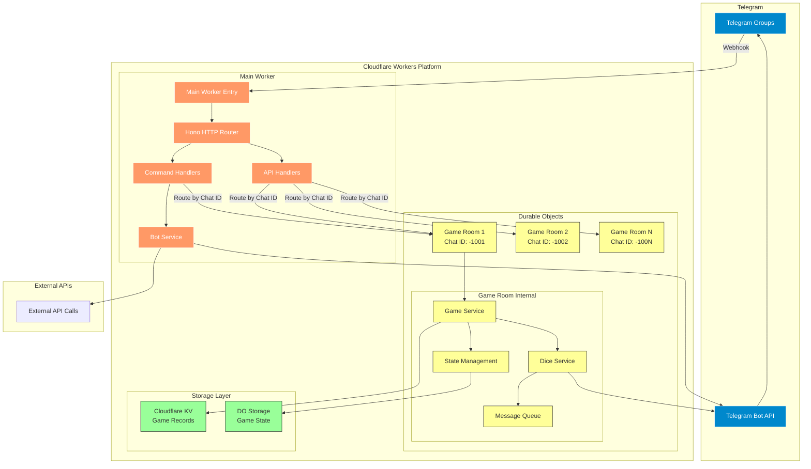
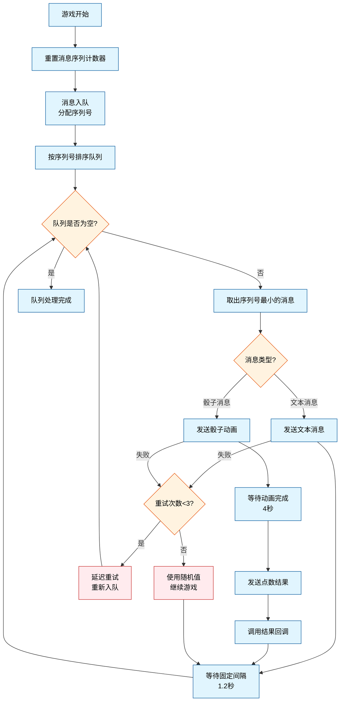
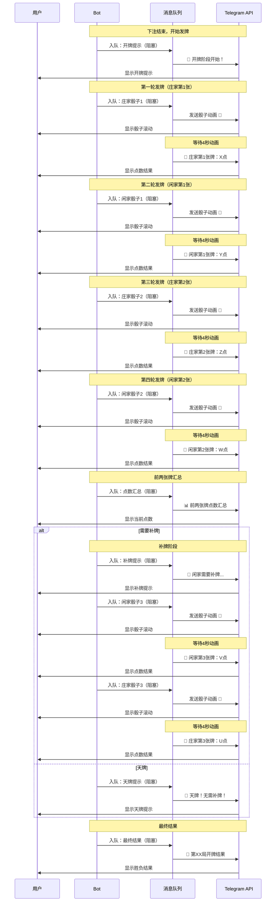

# 百家乐 Telegram Bot

一个部署在 Cloudflare Workers 上的 Telegram 百家乐游戏机器人，使用 Hono 和 Grammy 框架实现。支持群组游戏、自动化流程、完整百家乐规则以及自动游戏模式。

## 功能特性

### 🎲 游戏功能
- **完整百家乐规则**：支持庄家、闲家、和局三种下注类型。
- **真实补牌规则**：严格遵循百家乐标准补牌规则。
- **沉浸式发牌体验**：先显示骰子动画，等待4秒后公布点数，营造真实赌场氛围。
- **严格发牌顺序**：开牌提示 → 庄1 → 闲1 → 庄2 → 闲2 → 点数汇总 → 补牌提示 → 补牌 → 最终结果。
- **消息队列系统**：确保发牌顺序和消息一致性，防止并发问题。
- **自动游戏流程**：30秒下注时间，精准倒计时提醒，自动开牌，结果公布。
- **自动游戏模式**：支持连续自动进行游戏，每局间隔10秒。
- **多群组支持**：每个群组通过 Durable Objects 维护独立游戏状态。
- **数据持久化**：使用 Cloudflare KV 存储游戏记录，结合内存缓存。

### 🤖 Bot 命令
- `/start` - 启动 Bot 并显示完整游戏说明。
- `/id` - 获取群组和用户 ID 信息。
- `/newgame` - 开始新的百家乐游戏。
- `/bet <类型> <金额>` - 下注（banker/player/tie，例如 `/bet banker 100`）。
- `/process` - 手动触发游戏处理（开牌）。
- `/status` - 查看当前游戏状态和下注汇总。
- `/stopgame` - 停止当前游戏并关闭自动模式。
- `/autogame` - 开启自动游戏模式。
- `/stopauto` - 关闭自动游戏模式。
- `/history` - 查看最近10局游戏记录。
- `/gameinfo <游戏编号>` - 查看指定游戏的详细信息。
- `/help` - 显示帮助信息。

### 🎯 游戏规则
- **下注类型**：
  - `banker` - 庄家胜（1:1赔率）。
  - `player` - 闲家胜（1:1赔率）。
  - `tie` - 和局（8:1赔率）。
- **补牌规则**：严格按照百家乐标准规则（闲家0-5点补牌，庄家根据规则判断）。
- **点数计算**：使用 Telegram 骰子（1-6点）模拟牌值，总和取个位数。
- **天牌规则**：庄家或闲家前两张牌总和为8或9点，直接结束游戏。

### 🔧 HTTP API 接口
- `GET /` - 返回服务状态。
- `GET /health` - 健康检查。
- `POST /webhook` - 处理 Telegram Webhook 请求。
- `POST /auto-game/:chatId` - 为指定群组自动开始游戏。
- `POST /enable-auto/:chatId` - 启用自动游戏模式。
- `POST /disable-auto/:chatId` - 禁用自动游戏模式。
- `POST /process-game/:chatId` - 处理超时或手动触发的游戏。
- `GET /game-status/:chatId` - 获取指定群组的游戏状态。
- `GET /game-history/:chatId` - 获取指定群组的最近游戏记录（最多100局）。
- `GET /game-detail/:gameNumber` - 获取指定游戏编号的详细信息。
- `POST /send-message` - 向指定群组发送消息。
- `POST /set-webhook` - 设置 Telegram Webhook。

## 🏗️ 系统架构



## 🔄 消息队列系统

### 设计理念
消息队列系统是整个游戏体验的核心，确保所有消息和骰子动画按严格顺序执行，避免并发导致的消息乱序问题。

### 核心特性
- **严格序列控制**：每个消息分配唯一序列号，确保按序处理
- **阻塞与非阻塞**：支持阻塞消息（等待完成）和非阻塞消息（立即返回）
- **骰子动画管理**：专门处理骰子发送和结果公布的完整流程
- **容错处理**：网络失败时自动重试，最终使用随机值保证游戏继续
- **游戏隔离**：每个游戏开始时重置消息序列，避免跨游戏干扰

### 消息类型

```typescript
interface QueuedMessage {
  id: string;              // 唯一消息ID
  chatId: string;          // 群组ID
  sequenceId: number;      // 严格序列号
  type: 'text' | 'dice';   // 消息类型
  isBlocking?: boolean;    // 是否阻塞后续消息
  timestamp: number;       // 创建时间戳
  retries?: number;        // 重试次数
}

interface DiceMessage extends QueuedMessage {
  type: 'dice';
  playerType: string;      // 'banker' 或 'player'
  cardIndex: number;       // 第几张牌 (1,2,3)
  onDiceResult?: (value: number) => void; // 结果回调
}
```

### 处理流程



### 阻塞与非阻塞机制

**阻塞消息（Blocking Messages）**：
- 骰子消息：必须等待动画完成和结果公布
- 关键游戏消息：下注汇总、开牌提示、最终结果
- 用途：确保关键信息按序到达用户

**非阻塞消息（Non-blocking Messages）**：
- 倒计时提醒：不影响游戏主流程
- 状态更新：实时信息推送
- 用途：提升用户体验，不阻塞游戏进度

### 使用示例

```typescript
// 阻塞消息：等待发送完成
await this.diceService.sendBlockingMessage(
  chatId,
  "🎲 **开牌阶段开始！**"
);

// 非阻塞消息：立即返回
this.diceService.sendMessage(
  chatId,
  "⏰ 下注倒计时：10秒！"
);

// 骰子消息：等待完整流程
const diceValue = await this.diceService.rollDice(
  chatId, 
  'banker', 
  1
);
```

## 🎴 发牌顺序详解

### 完整发牌流程



### 发牌时间轴

| 阶段 | 消息类型 | 内容 | 等待时间 | 累计时间 |
|------|----------|------|----------|----------|
| 1 | 阻塞文本 | 🎲 开牌阶段开始！ | 1.2s | 1.2s |
| 2 | 阻塞骰子 | 庄家第1张牌 | 4s+1s | 6.2s |
| 3 | 阻塞骰子 | 闲家第1张牌 | 4s+1s | 11.2s |
| 4 | 阻塞骰子 | 庄家第2张牌 | 4s+1s | 16.2s |
| 5 | 阻塞骰子 | 闲家第2张牌 | 4s+1s | 21.2s |
| 6 | 阻塞文本 | 📊 前两张牌点数汇总 | 1.2s | 22.4s |
| 7 | 阻塞文本 | 补牌提示（如需要） | 1.2s | 23.6s |
| 8 | 阻塞骰子 | 第3张牌（如需要） | 4s+1s | 28.6s |
| 9 | 阻塞文本 | 🎯 最终开牌结果 | 1.2s | 29.8s |

### 关键实现代码

```typescript
// 严格按序发牌
private async dealCards(): Promise<void> {
  console.log('Starting card dealing with strict sequence...');

  try {
    // 🔥 严格按顺序发牌，每张牌等待完成
    console.log('🎲 Dealing banker card 1...');
    const bankerCard1 = await this.diceService.rollDice(this.game.chatId, 'banker', 1);
    this.game.cards.banker.push(bankerCard1);

    console.log('🎲 Dealing player card 1...');
    const playerCard1 = await this.diceService.rollDice(this.game.chatId, 'player', 1);
    this.game.cards.player.push(playerCard1);

    console.log('🎲 Dealing banker card 2...');
    const bankerCard2 = await this.diceService.rollDice(this.game.chatId, 'banker', 2);
    this.game.cards.banker.push(bankerCard2);

    console.log('🎲 Dealing player card 2...');
    const playerCard2 = await this.diceService.rollDice(this.game.chatId, 'player', 2);
    this.game.cards.player.push(playerCard2);

    // 🔥 发牌完成后再发送汇总，使用阻塞消息
    await this.diceService.sendBlockingMessage(
      this.game.chatId,
      `📊 **前两张牌点数:**\n` +
      `🏦 庄家: ${this.game.cards.banker.join(' + ')} = **${bankerSum} 点**\n` +
      `👤 闲家: ${this.game.cards.player.join(' + ')} = **${playerSum} 点**`
    );

    // 判断是否需要补牌...
  } catch (error) {
    console.error('Deal cards error:', error);
    throw error;
  }
}

// 骰子发送的完整流程
async rollDice(chatId: string, playerType: string, cardIndex: number): Promise<number> {
  try {
    // 使用消息队列处理骰子，严格按顺序
    const diceValue = await this.messageQueue.enqueueDice(chatId, playerType, cardIndex);
    return diceValue;
  } catch (error) {
    // 最终失败时使用随机值
    const fallbackValue = Math.floor(Math.random() * 6) + 1;
    return fallbackValue;
  }
}
```

## 快速开始

### 1. 准备工作

```bash
# 克隆项目
git clone <your-repo-url>
cd baccarat-telegram-bot

# 安装依赖
npm install

# 安装 Wrangler CLI
npm install -g wrangler

# 登录 Cloudflare
wrangler login
```

### 2. 创建 Telegram Bot

1. 在 Telegram 中找到 [@BotFather](https://t.me/botfather)。
2. 发送 `/newbot` 创建新 Bot。
3. 设置 Bot 名称和用户名。
4. 获取 Bot Token。
5. 设置 Bot 命令菜单：
   ```
   /setcommands
   选择你的 Bot
   发送以下命令列表：
   start - 启动 Bot
   id - 获取群组ID
   newgame - 开始新游戏
   bet - 下注 (格式: /bet banker 100)
   process - 处理游戏
   status - 查看游戏状态
   stopgame - 停止游戏
   autogame - 开启自动游戏模式
   stopauto - 关闭自动游戏模式
   history - 查看最近10局记录
   gameinfo - 查看游戏详情
   help - 查看帮助
   ```

### 3. 配置 wrangler.jsonc

更新 `wrangler.jsonc` 文件，配置基础信息和时间参数：

```jsonc
{
  "$schema": "node_modules/wrangler/config-schema.json",
  "name": "bc-services",
  "main": "src/index.ts",
  "compatibility_date": "2025-07-19",
  "compatibility_flags": ["nodejs_compat"],
  "vars": {
    // 基础配置
    "BOT_TOKEN": "your-bot-token-here",
    "ALLOWED_CHAT_IDS": "-1001234567890",
    
    // ===== 游戏时间配置 =====
    
    // 🎮 核心游戏时间
    "BETTING_DURATION_MS": "30000",           // 下注阶段持续时间 (30秒)
    "AUTO_GAME_INTERVAL_MS": "10000",         // 自动游戏间隔时间 (10秒)
    
    // 🎲 骰子相关时间
    "DICE_ROLL_TIMEOUT_MS": "10000",          // 骰子投掷超时 (10秒)
    "DICE_ROLL_MAX_RETRIES": "2",             // 骰子投掷最大重试次数
    "DICE_ANIMATION_WAIT_MS": "4000",         // 骰子动画等待时间 (4秒)
    "DICE_RESULT_DELAY_MS": "1000",           // 结果发送延迟 (1秒)
    
    // ⏱️ 流程控制时间
    "CARD_DEAL_DELAY_MS": "500",              // 发牌间隔 (0.5秒)
    "MESSAGE_DELAY_MS": "2000",               // 消息发送间隔 (2秒)
    
    // 🔒 系统保护时间
    "GLOBAL_PROCESS_TIMEOUT_MS": "90000",     // 游戏处理全局超时 (90秒)
    "CLEANUP_DELAY_MS": "30000"               // 清理延迟时间 (30秒)
  },
  "kv_namespaces": [
    {
      "binding": "BC_GAME_KV",
      "id": "your-kv-namespace-id"
    }
  ],
  "durable_objects": {
    "bindings": [
      {
        "name": "GAME_ROOMS",
        "class_name": "BaccaratGameRoom"
      }
    ]
  },
  "migrations": [
    {
      "tag": "v1",
      "new_sqlite_classes": ["BaccaratGameRoom"]
    }
  ]
}
```

### 4. 创建 KV 存储

```bash
# 创建 KV namespace
wrangler kv:namespace create "BC_GAME_KV"

# 将返回的 namespace ID 添加到 wrangler.jsonc 中
```

### 5. 部署

```bash
# 开发环境测试
npm run dev

# 部署到生产环境
npm run deploy

# 设置 Webhook
curl -X POST "https://your-worker.workers.dev/set-webhook" \
  -H "Content-Type: application/json" \
  -d '{"url": "https://your-worker.workers.dev/webhook"}'
```

## 游戏流程详解

### 1. 开始游戏
```
管理员或成员: /newgame
Bot: 🎲 第 20250719143001 局百家乐开始！
     💰 下注时间：30秒
     📝 下注格式：/bet banker 100
     ⏰ 系统将自动倒计时和开牌
     💡 或使用 /process 立即开牌
```

### 2. 下注阶段（精准倒计时）
```
玩家A: /bet banker 100
Bot: ✅ 玩家A 下注成功！💰 庄家 100 点
     👥 当前参与人数：1
     ⏰ 剩余时间：25 秒

玩家B: /bet player 50
Bot: ✅ 玩家B 下注成功！💰 闲家 50 点
     👥 当前参与人数：2
     ⏰ 剩余时间：20 秒

# 系统自动倒计时提醒
Bot: ⏰ 下注倒计时：20秒！
     👥 当前参与人数：2
     💡 抓紧时间下注哦~

Bot: ⏰ 下注倒计时：10秒！
     👥 当前参与人数：2
     💡 抓紧时间下注哦~

Bot: ⏰ 下注倒计时：5秒！
     👥 当前参与人数：2
     💡 抓紧时间下注哦~
```

### 3. 沉浸式开牌体验
30秒后或手动 `/process`：
```
Bot: ⛔️ 第 20250719143001 局停止下注！
     📊 下注汇总：
     🏦 庄家: 100 点
     👤 闲家: 50 点
     
     🎲 开牌阶段开始！
     🃏 庄家和闲家各发两张牌...

# 发送骰子动画
Bot: 🎲 (骰子动画滚动 4秒)

# 4秒后公布结果
Bot: 🎯 🏦 庄家第1张牌开出：4 点

# 短暂停顿 1秒后继续
Bot: 🎲 (骰子动画滚动 4秒)
Bot: 🎯 👤 闲家第1张牌开出：6 点

Bot: 🎲 (骰子动画滚动 4秒)
Bot: 🎯 🏦 庄家第2张牌开出：3 点

Bot: 🎲 (骰子动画滚动 4秒)
Bot: 🎯 👤 闲家第2张牌开出：2 点
     
     📊 前两张牌点数：
     🏦 庄家: 4 + 3 = 7 点
     👤 闲家: 6 + 2 = 8 点
     
     🎯 天牌！无需补牌！
     
     🎯 第 20250719143001 局开牌结果
     🏦 庄家最终点数: 7 点
     👤 闲家最终点数: 8 点
     👤 闲家胜！
     
     ✅ 获胜者：
     玩家B: +50
     
     ❌ 失败者：
     玩家A: -100
     
     🔄 自动游戏模式：10秒后开始下一局
```

### 4. 自动游戏模式
```
管理员: /autogame
Bot: 🤖 自动游戏模式已开启！
     🔄 游戏将持续自动进行
     ⏰ 每局间隔10秒
     💡 即使无人下注也会继续发牌
     🛑 使用 /stopauto 关闭自动模式
```

## 时间参数配置详解

### 🎮 核心游戏时间配置
| 参数 | 默认值 | 说明 |
|------|--------|------|
| `BETTING_DURATION_MS` | 30000 | 下注阶段持续时间（毫秒），用户可以下注的总时长 |
| `AUTO_GAME_INTERVAL_MS` | 10000 | 自动游戏间隔时间（毫秒），每局游戏结束后到下一局开始的等待时间 |

### 🎲 骰子体验配置
| 参数 | 默认值 | 说明 |
|------|--------|------|
| `DICE_ROLL_TIMEOUT_MS` | 10000 | 骰子投掷超时时间（毫秒），单次骰子API调用的最大等待时间 |
| `DICE_ROLL_MAX_RETRIES` | 2 | 骰子投掷最大重试次数，失败后重试的次数 |
| `DICE_ANIMATION_WAIT_MS` | 4000 | 骰子动画等待时间（毫秒），等待骰子动画播放完成的时间 |
| `DICE_RESULT_DELAY_MS` | 1000 | 结果发送延迟（毫秒），发送点数结果后的停顿时间，让用户消化结果 |

### ⏱️ 流程控制配置
| 参数 | 默认值 | 说明 |
|------|--------|------|
| `CARD_DEAL_DELAY_MS` | 500 | 发牌间隔时间（毫秒），每张牌之间的等待时间，让用户看清楚发牌过程 |
| `MESSAGE_DELAY_MS` | 2000 | 消息发送间隔（毫秒），重要消息之间的间隔，避免刷屏 |

### 🔒 系统保护配置
| 参数 | 默认值 | 说明 |
|------|--------|------|
| `GLOBAL_PROCESS_TIMEOUT_MS` | 90000 | 游戏处理全局超时（毫秒），整个游戏处理的最大时长，防止卡死 |
| `CLEANUP_DELAY_MS` | 30000 | 清理延迟时间（毫秒），游戏结束后多久开始清理资源 |

### 🎯 时间配置优化建议

**快节奏游戏设置**：
```jsonc
"BETTING_DURATION_MS": "20000",        // 20秒下注
"AUTO_GAME_INTERVAL_MS": "5000",       // 5秒间隔
"DICE_ANIMATION_WAIT_MS": "3000",      // 3秒动画
"MESSAGE_DELAY_MS": "1500"             // 1.5秒消息间隔
```

**慢节奏体验设置**：
```jsonc
"BETTING_DURATION_MS": "45000",        // 45秒下注
"AUTO_GAME_INTERVAL_MS": "15000",      // 15秒间隔
"DICE_ANIMATION_WAIT_MS": "5000",      // 5秒动画
"MESSAGE_DELAY_MS": "3000"             // 3秒消息间隔
```

**网络环境差的设置**：
```jsonc
"DICE_ROLL_TIMEOUT_MS": "15000",       // 15秒超时
"DICE_ROLL_MAX_RETRIES": "3",          // 3次重试
"GLOBAL_PROCESS_TIMEOUT_MS": "120000"  // 2分钟总超时
```

## API 使用示例

### 自动化游戏管理
```bash
# 为指定群组自动开始游戏
curl -X POST "https://your-worker.workers.dev/auto-game/-1001234567890" \
  -H "Content-Type: application/json"

# 启用自动游戏模式
curl -X POST "https://your-worker.workers.dev/enable-auto/-1001234567890" \
  -H "Content-Type: application/json"

# 禁用自动游戏模式
curl -X POST "https://your-worker.workers.dev/disable-auto/-1001234567890" \
  -H "Content-Type: application/json"

# 检查游戏状态
curl "https://your-worker.workers.dev/game-status/-1001234567890"

# 获取最近游戏记录
curl "https://your-worker.workers.dev/game-history/-1001234567890"

# 获取指定游戏详情
curl "https://your-worker.workers.dev/game-detail/20250719143001"
```

### 消息发送
```bash
# 发送游戏通知
curl -X POST "https://your-worker.workers.dev/send-message" \
  -H "Content-Type: application/json" \
  -d '{
    "chatId": "-1001234567890",
    "message": "🎮 **百家乐夜场即将开始！**\n\n准备好你的筹码了吗？",
    "parseMode": "Markdown"
  }'
```

## 项目结构

```
├── src/
│   ├── index.ts                    # 主程序文件
│   ├── config/
│   │   └── constants.ts           # 时间配置管理
│   ├── durable-objects/
│   │   └── baccaratGameRoom.ts    # 游戏房间 Durable Object
│   ├── handlers/
│   │   ├── apiHandlers.ts         # HTTP API 路由处理
│   │   ├── commandHandlers.ts     # Bot 命令处理
│   │   └── index.ts               # 处理器导出
│   ├── services/
│   │   ├── botService.ts          # Telegram Bot 服务
│   │   ├── diceService.ts         # 骰子发送服务（含动画流程）
│   │   ├── gameService.ts         # 核心游戏逻辑
│   │   ├── messageQueue.ts        # 消息队列服务
│   │   ├── storageService.ts      # KV 存储服务
│   │   └── index.ts               # 服务导出
│   ├── types/
│   │   ├── api.ts                 # API 类型定义
│   │   ├── env.ts                 # 环境变量类型
│   │   ├── game.ts                # 游戏相关类型
│   │   └── index.ts               # 类型导出
│   └── utils/
│       ├── gameUtils.ts           # 游戏工具函数
│       ├── messageUtils.ts        # 消息格式化工具
│       ├── timeUtils.ts           # 时间工具函数
│       └── index.ts               # 工具导出
├── package.json                   # 项目依赖
├── wrangler.jsonc                 # Cloudflare Workers 配置（含时间参数）
├── tsconfig.json                  # TypeScript 配置
└── README.md                      # 项目说明文档
```

## 核心技术特性

### 游戏状态管理
```typescript
enum GameState {
  Idle = 'idle',          // 空闲
  Betting = 'betting',    // 下注中
  Processing = 'processing', // 处理中
  Revealing = 'revealing',   // 开牌中
  Finished = 'finished'      // 已结束
}
```

### 沉浸式骰子体验
```typescript
// 骰子发送流程
async rollDice(chatId: string, playerType: string, cardIndex: number): Promise<number> {
  // 1. 🎲 发送骰子动画
  const diceMessage = await this.bot.api.sendDice(chatId, '🎲');
  
  // 2. ⏳ 等待动画播放完成（4秒）
  await sleep(this.constants.DICE_ANIMATION_WAIT_MS);
  
  // 3. 📢 公布点数结果
  await this.sendDiceResult(chatId, playerType, cardIndex, diceValue);
  
  // 4. 🔄 停顿后继续下一张牌（1秒）
  await sleep(this.constants.DICE_RESULT_DELAY_MS);
}
```

### 精准倒计时系统
```typescript
// 动态倒计时，确保时间一致性
private setupCountdownTimers(chatId: string, gameNumber: string): void {
  const gameEndTime = this.game.bettingEndTime;
  const intervals = [20, 10, 5]; // 提醒时间点

  intervals.forEach(seconds => {
    const reminderTime = gameEndTime - (seconds * 1000);
    const timeToReminder = reminderTime - Date.now();

    if (timeToReminder > 0) {
      setTimeout(() => {
        sendCountdownMessage(seconds);
      }, timeToReminder);
    }
  });
}
```

### 消息队列核心实现
```typescript
// 严格序列处理
private async processQueue(): Promise<void> {
  this.processing = true;
  
  while (this.queue.length > 0) {
    // 取出序列号最小的消息
    const message = this.queue.shift()!;
    
    try {
      await this.processMessage(message);
      
      // 固定延迟，确保消息不会太快
      await sleep(this.messageDelay);
      
    } catch (error) {
      await this.handleMessageError(message, error);
    }
  }
  
  this.processing = false;
}
```

### 数据存储策略
- **双重存储**：Durable Objects 维护当前游戏状态，Cloudflare KV 存储游戏记录。
- **历史记录**：最近100局游戏记录保存在 KV 中。
- **清理机制**：非自动模式下，游戏结束后30秒清理数据。
- **容错处理**：KV 故障时依赖内存缓存，异常情况自动恢复。

### 补牌规则实现
- **闲家规则**：0-5点补牌，6-7点停牌，8-9点天牌。
- **庄家规则**：根据自身点数和闲家第三张牌决定补牌。
- **天牌判断**：庄家或闲家前两张牌总和为8或9点，立即结束游戏。

## 环境变量配置

| 变量名             | 必需 | 说明                           | 示例                          |
|--------------------|------|--------------------------------|-------------------------------|
| `BOT_TOKEN`        | ✅   | Telegram Bot Token             | `1234567890:ABC...`          |
| `ALLOWED_CHAT_IDS` | ❌   | 允许的群组ID列表（逗号分隔）   | `-1001234567890,-1009876543210` |

所有时间相关参数都在 `wrangler.jsonc` 的 `vars` 字段中配置。

## 监控和维护

### 日志查看
```bash
# 实时日志
wrangler tail

# 特定环境日志
wrangler tail --env production
```

### 性能监控
- 监控活跃游戏数量和 API 响应时间。
- 跟踪错误率和异常情况。
- 检查 KV 存储的读写性能。
- 监控骰子 API 调用成功率和延迟。
- 检查消息队列处理效率和阻塞情况。

### 数据清理
- 非自动模式下，游戏数据在游戏结束后30秒自动清理。
- KV 存储中的游戏记录保留最近100局，无显式TTL。
- 内存缓存通过 Durable Objects 管理，异常时自动恢复。
- 消息队列在游戏开始时自动重置，避免跨游戏干扰。

## 部署最佳实践

### 1. 安全配置
- 定期轮换 `BOT_TOKEN`。
- 配置 `ALLOWED_CHAT_IDS` 限制群组访问。

### 2. 性能优化
- 按需创建 Bot 实例，减少资源占用。
- 优化 KV 读写，优先使用内存缓存。
- 使用 Durable Objects 确保群组隔离和状态一致性。
- 根据网络环境调整骰子超时和重试参数。
- 合理配置消息队列延迟，平衡体验和性能。

### 3. 错误处理
- 网络请求失败时自动重试。
- 游戏状态异常时通过 `/stopgame` 清理。
- 用户输入验证，确保下注格式和金额有效。
- 骰子发送失败时使用随机值保证游戏流程。
- 消息队列异常时自动清理，重置状态。

## 故障排除

### 常见问题

1. **游戏无法开始**
   - 检查 Bot 是否有群组发送消息权限。
   - 确认 `BOT_TOKEN` 和 KV 配置正确。
   - 检查是否存在未结束的游戏（使用 `/status` 查看）。

2. **下注失败**
   - 确保下注在30秒时间内（`/status` 查看剩余时间）。
   - 验证下注格式（例如 `/bet banker 100`）。
   - 确认游戏状态为 `betting`。

3. **倒计时时间不一致**
   - 检查服务器时间同步。
   - 确认 `BETTING_DURATION_MS` 配置正确。
   - 验证倒计时逻辑是否基于同一时间源。

4. **骰子发送失败**
   - 检查 Telegram API 连接状态。
   - 调整 `DICE_ROLL_TIMEOUT_MS` 和重试次数。
   - 确认群组允许发送动画消息。

5. **消息顺序混乱**
   - 检查消息队列状态（通过 API 获取调试信息）。
   - 确认游戏开始时队列是否正确重置。
   - 验证序列号分配是否正确递增。

6. **Webhook 问题**
   - 验证 Workers URL 是否可访问。
   - 检查 SSL 证书是否有效。
   - 确保防火墙未阻止 Telegram 的请求。

### 调试技巧
```bash
# 检查 Webhook 状态
curl "https://api.telegram.org/bot<YOUR_TOKEN>/getWebhookInfo"

# 测试 API 连通性
curl "https://your-worker.workers.dev/health"

# 查看特定群组游戏状态（含调试信息）
curl "https://your-worker.workers.dev/game-status/-1001234567890"

# 查看最近游戏记录
curl "https://your-worker.workers.dev/game-history/-1001234567890"

# 检查消息队列状态
# 在游戏状态 API 响应中查看 debug.queueLength 和 debug.queueProcessing
```

## 扩展功能建议

### 1. 高级功能
- [ ] 用户积分系统：记录玩家胜负和积分。
- [ ] 统计报表：生成每日/每周游戏统计。
- [ ] 定时游戏：按计划自动开启游戏。
- [ ] 下注限制：设置用户单次和总下注限额。
- [ ] 消息队列监控：实时查看队列状态和处理效率。

### 2. 社交功能
- [ ] 排行榜：显示群组内玩家胜率和收益排名。
- [ ] 成就系统：解锁游戏里程碑奖励。
- [ ] 群组对战：支持多群组竞技模式。
- [ ] 好友系统：添加好友并查看战绩。

### 3. 管理功能
- [ ] 管理员面板：通过 Bot 命令管理游戏参数。
- [ ] 用户权限：设置下注限制或管理员权限。
- [ ] 反作弊：检测异常下注行为。
- [ ] 时间配置热更新：运行时调整游戏参数。
- [ ] 消息队列管理：手动清理队列、调整处理速度。

### 4. 体验优化
- [ ] 声音效果：配合骰子动画的音效。
- [ ] 自定义表情：个性化的牌面显示。
- [ ] 多语言支持：国际化界面和消息。
- [ ] 移动端优化：响应式消息布局。
- [ ] 发牌动画优化：更丰富的视觉效果。

## License

[MIT](./LICENSE) License © 2025-PRESENT [wudi](https://github.com/WuChenDi)
